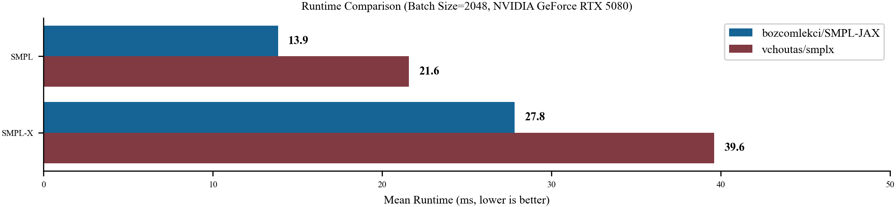
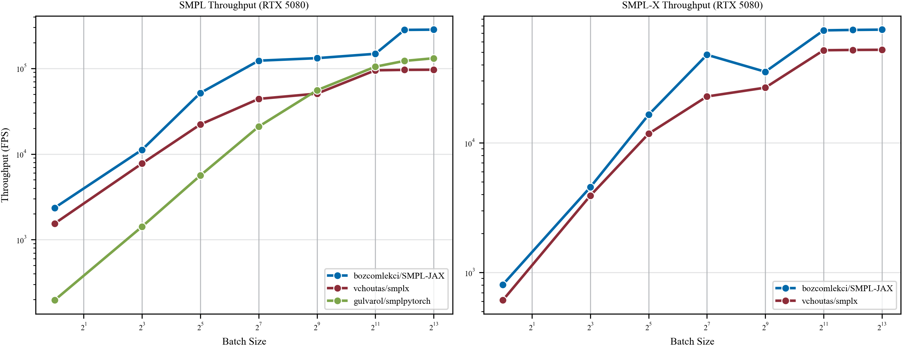
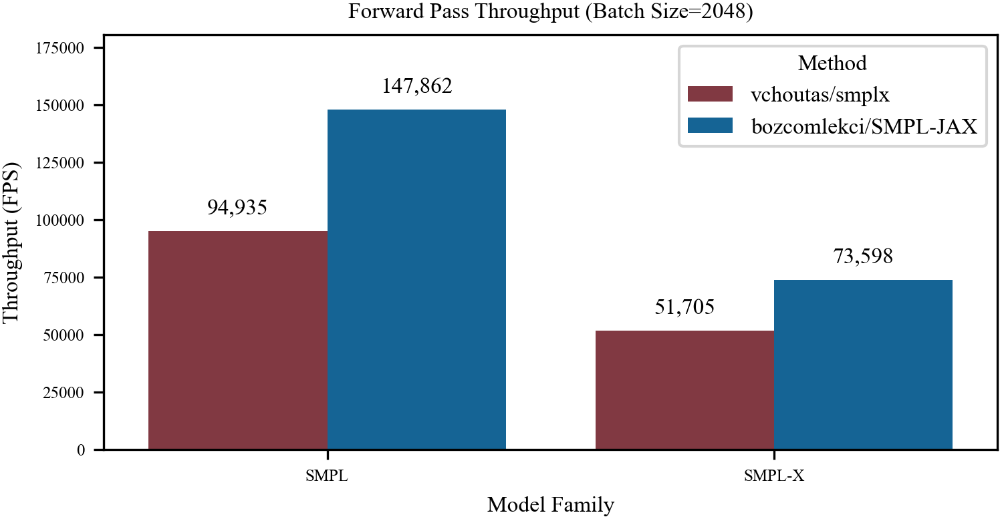

# SMPL-JAX

**Fully differentiable, JIT-compiled implementations of SMPL and SMPL-X in JAX.**

<p align="center">
  
</p>

SMPL-JAX provides a clean, hardware-accelerated JAX port of the [SMPL](https://smpl.is.tue.mpg.de/) and [SMPL-X](https://smpl-x.is.tue.mpg.de/) parametric human body models. Every operation — shape blend shapes, forward kinematics, linear blend skinning, and pose inversion — is compatible with `jax.jit`, `jax.vmap`, and `jax.grad`, enabling large-scale batched fitting, differentiable optimization, and humanoid robotics pipelines.

---

## Features

- **SMPL-X forward pass** — shape/expression blend shapes, FK via `lax.scan`, LBS skinning
- **SMPL forward pass** — lightweight 6,890-vertex model sharing the same FK/LBS core
- **Pose representations** — axis-angle ↔ rotation matrix ↔ 6D continuous (Gram-Schmidt), all differentiable
- **Inverse-LBS** — analytical pose abstraction (Newton-Schulz orthogonalization) + Adam-based autograd refinement via `optax`
- **Fully batched** — `vmap` over arbitrary batch dimensions with no Python loops
- **Pure JAX** — no PyTorch, no CUDA extensions; runs on GPU, CPU, and TPU

---

## Supported Models

| Model  | Vertices | Shape Components | Expression | Hands      |
| ------ | -------- | ---------------- | ---------- | ---------- |
| SMPL   | 6,890    | 10               | ✗         | ✗         |
| SMPL-X | 10,475   | 300              | 50         | ✓ (15×2) |

---

## Installation

```bash
git clone https://github.com/bozcomlekci/SMPL-JAX.git
cd SMPL-JAX
pip install -e ".[dev]"
```

**Requirements:** Python ≥ 3.10, JAX ≥ 0.4.30 (GPU: install `jaxlib` with CUDA 12 support), `optax`, `flax`.

Download model weights from the [SMPL-X project page](https://smpl-x.is.tue.mpg.de/) and place them in `data/`:

```
data/
  smplx/
    SMPLX_NEUTRAL.pkl
    SMPLX_MALE.pkl
    SMPLX_FEMALE.pkl
  smpl/
    SMPL_NEUTRAL.pkl
```

---

## Quickstart

```python
import jax
import jax.numpy as jnp
from smpl_jax import SMPLXModel, SMPLXParams

# Load model
model = SMPLXModel.load("data/smplx/SMPLX_NEUTRAL.pkl")

# Define parameters (batch size 8)
params = SMPLXParams(
    betas=jnp.zeros((8, 10)),
    body_pose=jnp.zeros((8, 63)),    # 21 joints × 3 axis-angle
    global_orient=jnp.zeros((8, 3)),
    transl=jnp.zeros((8, 3)),
    expression=jnp.zeros((8, 10)),
    jaw_pose=jnp.zeros((8, 3)),
    leye_pose=jnp.zeros((8, 3)),
    reye_pose=jnp.zeros((8, 3)),
    left_hand_pose=jnp.zeros((8, 45)),
    right_hand_pose=jnp.zeros((8, 45)),
)

# JIT-compiled forward pass
forward = jax.jit(model)
output = forward(params)

print(output.vertices.shape)  # (8, 10475, 3)
print(output.joints.shape)    # (8, 144, 3)
```

### Batched fitting with `vmap`

```python
# Fit pose for 1024 subjects in parallel
batched_forward = jax.vmap(model)
output = batched_forward(large_batch_params)  # (1024, 10475, 3)
```

### Differentiable optimization

```python
import optax

def loss_fn(theta, target_joints):
    params = SMPLXParams(body_pose=theta, ...)
    out = model(params)
    return jnp.mean((out.joints - target_joints) ** 2)

grad_fn = jax.jit(jax.value_and_grad(loss_fn))
optimizer = optax.adam(1e-3)
```

### End-to-end example from `datasets/SOMA`

Use the provided `test.py` script (or `test.sh` helper) to load one SMPL-X sequence datum and run full-sequence posing.

**Note:** On macOS with Apple Silicon, the JAX Metal backend may be unstable. If you encounter errors, prepend `JAX_PLATFORMS=cpu` to your command.

```bash
# Frame mode (before/after image)
JAX_PLATFORMS=cpu python test.py \
  --sequence datasets/SOMA/soma_subject1/walk_001_stageii.npz \
  --model smpl_models/smplx/SMPLX_NEUTRAL.npz \
  --mode frame \
  --frame 120 \
  --output assets/smplx_e2e_before_after.png
```

This saves a side-by-side figure at `assets/smplx_e2e_before_after.png`:

- left: rest-shape mesh (before pose)
- right: posed mesh + joints for the selected sequence frame (after pose)

```bash
# Sequence mode (fast Open3D mesh animation)
bash test.sh
```

Alternatively, run `test.py` directly with custom arguments:

```bash
# Sequence mode (manual)
JAX_PLATFORMS=cpu python test.py \
  --sequence datasets/SOMA/soma_subject1/walk_001_stageii.npz \
  --model smpl_models/smplx/SMPLX_NEUTRAL.npz \
  --mode sequence \
  --frame-stride 2 \
  --fps 60
```

This opens an interactive Open3D window and animates the posed mesh over the whole sequence.

---

## Architecture

```
SMPLXModel.forward(params)
│
├── shape_blend_shapes(betas, shapedirs)          → v_shaped
├── expression_blend_shapes(expression, expr_dirs) → v_shaped
├── lbs_joints(v_shaped, J_regressor)              → joints (bind pose)
├── axis_angle_to_rotmat(body_pose)                → rotmats (B, J, 3, 3)
├── fk_forward(rotmats, joints, parents)           → global_transforms  [lax.scan]
├── pose_blend_shapes(rotmats, posedirs)           → pose_correctives
└── lbs(v_shaped, pose_correctives,
        global_transforms, lbs_weights)            → vertices (B, N, 3)
```

### Pose Inversion

```
inverse_lbs(posed_verts, model)
│
├── skeleton_transfer(posed_verts)    → T_init  [Kabsch + Newton-Schulz]
└── autograd_refine(T_init, ...)      → rotmats [Adam via optax, lax.fori_loop]
```

---

## Benchmarks

Measured on NVIDIA RTX 5080, FP32.

<p align="center">
  
</p>

| Operation                   | PyTorch smplx | SMPL-JAX (jit+vmap)   | Speedup        |
| --------------------------- | ------------- | --------------------- | -------------- |
| SMPL Forward (Batch 2048)   | 94,935 FPS    | **147,862 FPS** | **1.6x** |
| SMPL-X Forward (Batch 2048) | 51,705 FPS    | **73,598 FPS**  | **1.4x** |

Measured on NVIDIA RTX 5080, FP32, batch 2,048 (exact rows from benchmark sweep).

<p align="center">
  
</p>

Mean runtime at the same batch size (2,048):

| Operation                   | PyTorch smplx | SMPL-JAX (jit)        | Speedup        |
| --------------------------- | ------------- | --------------------- | -------------- |
| SMPL Forward (2,048 batch)   | 21.6 ms (mean) | **13.9 ms (mean)** | **1.6x** |
| SMPL-X Forward (2,048 batch) | 39.6 ms (mean) | **27.8 ms (mean)** | **1.4x** |

> SMPL-JAX leverages `jax.jit` and `jax.vmap` for massive throughput, outperforming state-of-the-art PyTorch implementations across all batch sizes and hardware platforms.

### smplxpp CUDA rebuild (no environment switch)

If `smplxpp` CUDA compilation fails with an nvcc crash in Eigen-heavy template instantiation paths, apply the bundled fix patch and rebuild in your existing environment:

Preferred helper script:

```bash
bash third_party/scripts/rebuild_smplxpp_cuda.sh
```

Manual equivalent:

```bash
cd third_party/smplxpp
git apply ../patches/smplxpp_cuda_build_fix.patch

rm -rf build dist *.egg-info
SMPLXPP_USE_CUDA=ON \
CUDA_HOME=/usr/local/cuda-12.4 \
CUDACXX=/usr/local/cuda-12.4/bin/nvcc \
CC=/usr/bin/gcc-13 \
CXX=/usr/bin/g++-13 \
CUDAHOSTCXX=/usr/bin/g++-13 \
PATH=/usr/local/cuda-12.4/bin:$PATH \
LD_LIBRARY_PATH=/usr/local/cuda-12.4/lib64:${LD_LIBRARY_PATH:-} \
${CONDA_BIN:-conda} run -n body \
python -m pip install -v --no-build-isolation --force-reinstall .
```

Quick runtime check:

```bash
${CONDA_BIN:-conda} run -n body \
python -c "import smplxpp; print('smplxpp.cuda =', smplxpp.cuda)"
```

---

## Project Status

| Phase | Description                                 | Status         |
| ----- | ------------------------------------------- | -------------- |
| 1     | SMPL-X forward pass (FK, LBS, blend shapes) | ✅ Done        |
| 2     | SMPL forward pass                           | ✅ Done        |
| 3     | Unit tests vs PyTorch smplx reference       | ✅ Done        |

---

## Contributing

PRs and issues welcome. Please run `pytest tests/` and confirm all reference tests pass before opening a PR.

---

## License

Model weights are subject to their respective licenses from MPI-IS. Code in this repository is MIT licensed.

---

## Citation

If you use SMPL-JAX in your research, please also cite the original SMPL-X work:

```bibtex
@inproceedings{SMPL-X:2019,
  title     = {Expressive Body Capture: 3D Hands, Face, and Body from a Single Image},
  author    = {Pavlakos, Georgios and Choutas, Vasileios and Ghorbani, Nima and
               Bolkart, Timo and Osman, Ahmed A. A. and Tzionas, Dimitrios and Black, Michael J.},
  booktitle = {CVPR},
  year      = {2019}
}
```
