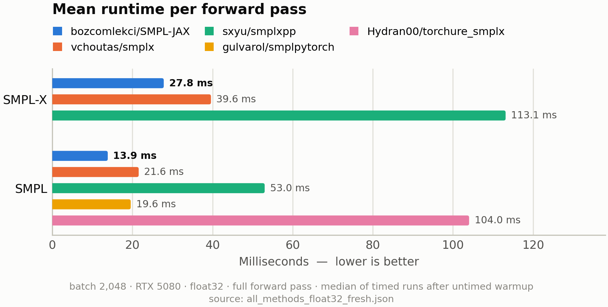
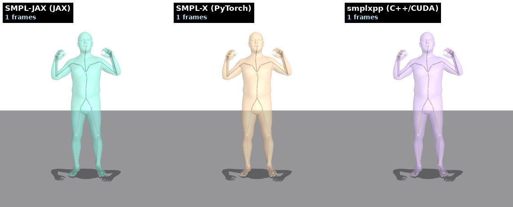
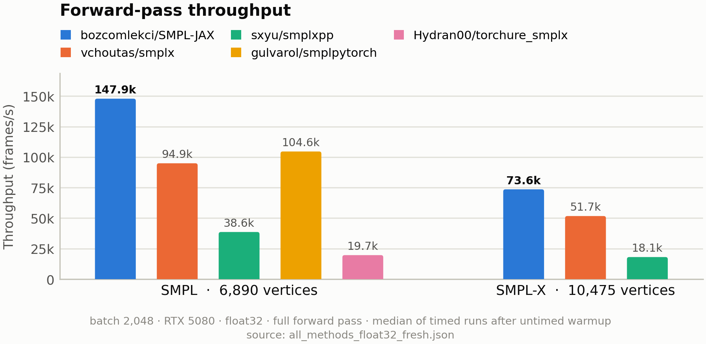
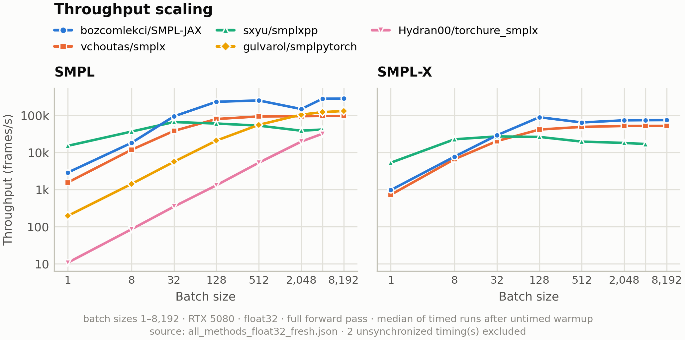

# SMPL-JAX

**Fully differentiable, JIT-compiled implementations of SMPL and SMPL-X in JAX.**

[](https://github.com/bozcomlekci/SMPL-JAX/actions/workflows/ci.yml)
[](LICENSE)
[](https://www.python.org/downloads/)
[](https://github.com/google/jax)

<p align="center">
  <picture>
    <source media="(prefers-color-scheme: dark)" srcset="benchmarks/figures/runtime_by_model_batch2048_dark.png">
    
  </picture>
</p>

SMPL-JAX provides a clean, hardware-accelerated JAX port of the [SMPL](https://smpl.is.tue.mpg.de/) and [SMPL-X](https://smpl-x.is.tue.mpg.de/) parametric human body models. Every operation — shape blend shapes, forward kinematics, linear blend skinning, and pose inversion — is compatible with `jax.jit`, `jax.vmap`, and `jax.grad`, enabling large-scale batched fitting and differentiable optimization.

<p align="center">
  
  <br>
  <em>Identical motion and settings posed by SMPL-JAX, <a href="https://github.com/vchoutas/smplx">vchoutas/smplx</a>, and <a href="https://github.com/sxyu/smplxpp">sxyu/smplxpp</a>; playback cadence is scaled to measured throughput.</em>
</p>

### Documentation

| Document | Contents |
| -------- | -------- |
| **README** (this file) | Install, quickstart, benchmarks |
| [ARCHITECTURE.md](ARCHITECTURE.md) | Forward-pass pipeline, module-by-module reference, design rationale, how to extend |
| [CONTRIBUTING.md](CONTRIBUTING.md) | Dev setup, running the tests, code conventions |
| [examples/README.md](examples/README.md) | Running the end-to-end mocap demo |
| [benchmarks/README.md](benchmarks/README.md) | Reproducing the throughput numbers |
| [tools/compare_render/README.md](tools/compare_render/README.md) | Regenerating the comparison GIFs |
| [envs/README.md](envs/README.md) | Pinned environments for reproducing published results |
| [third_party/scripts/README.md](third_party/scripts/README.md) | Building the C++/CUDA baselines |

---

## Features

- **SMPL-X forward pass** — shape/expression blend shapes, FK via `lax.scan`, LBS skinning
- **SMPL forward pass** — lightweight 6,890-vertex model sharing the same FK/LBS core
- **Pose representations** — axis-angle ↔ rotation matrix ↔ 6D continuous (Gram-Schmidt), all differentiable
- **Inverse-LBS** — analytical pose abstraction (Newton-Schulz orthogonalization) + Adam-based autograd refinement via `optax`
- **Fully batched** — `vmap` over arbitrary batch dimensions with no Python loops
- **Pure JAX** — no PyTorch, no CUDA extensions; runs on GPU, CPU, and TPU

---

## Supported Models

| Model  | Vertices | Shape Components | Expression | Hands      |
| ------ | -------- | ---------------- | ---------- | ---------- |
| SMPL   | 6,890    | 10               | ✗         | ✗         |
| SMPL-X | 10,475   | 300              | 50         | ✓ (15×2) |

---

## Installation

```bash
git clone https://github.com/bozcomlekci/SMPL-JAX.git
cd SMPL-JAX
pip install -e ".[dev]"
```

**Requirements:** Python ≥ 3.10, JAX ≥ 0.4.30 (GPU: install `jaxlib` with CUDA 12 support), `optax`, `numpy`. The library itself has no other dependencies — no PyTorch, no CUDA extensions.

Extras are scoped to one task each, so nothing pulls in another task's heavy dependencies:

| Extra | Installs | Needed for |
| ----- | -------- | ---------- |
| `.[dev]` | `pytest` | Running the test suite |
| `.[plots]` | `matplotlib`, `pandas`, `plotly` | Regenerating the [benchmark figures](benchmarks/README.md) |
| `.[examples]` | `matplotlib`, `open3d` | The [mocap demo](examples/README.md) |
| `.[render]` | `pyrender`, `trimesh`, `Pillow`, `PyOpenGL` | The [comparison GIF pipeline](tools/compare_render/README.md) |
| `.[reference]` | `torch`, `smplx` | Reference-parity tests, cross-implementation benchmarks |
| `.[all]` | all of the above | — |

Add `--recurse-submodules` when cloning if you want the C++/PyTorch baselines under [`third_party/`](third_party/); they are only used by the benchmarks and comparison renders.

To reproduce the published benchmark numbers exactly, [`envs/`](envs/README.md) has pinned conda environments for Linux/CUDA and macOS/Apple Silicon.

### Model weights

Download model weights from the [SMPL-X project page](https://smpl-x.is.tue.mpg.de/) and place them in `data/`:

```
data/
  smplx/
    SMPLX_NEUTRAL.pkl        # or .npz
    SMPLX_MALE.pkl
    SMPLX_FEMALE.pkl
  smpl/
    SMPL_NEUTRAL.pkl
```

`data/` is gitignored — the weights are licensed by MPI-IS and must not be committed. Everything except the reference-parity end-to-end tests runs without them.

---

## Repository layout

```
smpl_jax/                 the library — pure JAX, no heavy dependencies
├── smplx.py, smpl.py       model classes (SMPLXModel, SMPLModel)
├── _base.py                shared 7-step LBS forward pass
├── types.py                SMPLParams / SMPLXParams / *Output pytrees
├── model_io.py             .pkl / .npz loader, normalises all known variants
├── rotations.py            axis-angle ↔ rotmat ↔ 6D, safe_normalize
├── blend_shapes.py         shape / expression / pose blend shapes
├── kinematics.py           forward kinematics via lax.scan
├── lbs.py                  linear blend skinning
└── inverse_lbs.py          pose recovery from a posed mesh

tests/                    pytest suite (synthetic fixtures + PyTorch parity)
examples/                 runnable end-to-end demo on a mocap clip
benchmarks/               throughput harness, result JSON, plotting scripts
tools/compare_render/     side-by-side comparison GIF pipeline
third_party/              baseline implementations (git submodules) + build patches
envs/                     pinned conda environments for reproducing results
assets/                   figures and GIFs used by the docs
data/, datasets/          model weights and mocap clips (gitignored)
```

---

## Quickstart

```python
import jax
import jax.numpy as jnp
from smpl_jax import SMPLXModel, SMPLXParams

# Load model
model = SMPLXModel.load("data/smplx/SMPLX_NEUTRAL.pkl")

# Define parameters (batch size 8)
params = SMPLXParams(
    betas=jnp.zeros((8, 10)),
    body_pose=jnp.zeros((8, 63)),    # 21 joints × 3 axis-angle
    global_orient=jnp.zeros((8, 3)),
    transl=jnp.zeros((8, 3)),
    expression=jnp.zeros((8, 10)),
    jaw_pose=jnp.zeros((8, 3)),
    leye_pose=jnp.zeros((8, 3)),
    reye_pose=jnp.zeros((8, 3)),
    left_hand_pose=jnp.zeros((8, 45)),
    right_hand_pose=jnp.zeros((8, 45)),
)

# JIT-compiled forward pass
forward = jax.jit(model)
output = forward(params)

print(output.vertices.shape)  # (8, 10475, 3)
print(output.joints.shape)    # (8, 144, 3)
```

### Hand-pose convention

SMPL-X model files ship a MANO mean hand pose, and two conventions exist for
what a zero `left_hand_pose` / `right_hand_pose` means:

```python
SMPLXModel.load(path, flat_hand_mean=True)   # default — zeros = flat open hand
SMPLXModel.load(path, flat_hand_mean=False)  # zeros = relaxed MANO hand
```

`flat_hand_mean=True` is the default because it matches AMASS / SOMA
`*_stageii.npz` clips, whose `pose_hand` field is absolute axis-angle, and it is
what `benchmarks/` and `tools/compare_render/` pass to the reference PyTorch
`smplx` package. `flat_hand_mean=False` reproduces that package's own default.
The two differ by up to ~7.6 cm in vertex position, so the flag has to match
whatever produced the pose parameters.

### Batched fitting with `vmap`

```python
# Fit pose for 1024 subjects in parallel
batched_forward = jax.vmap(model)
output = batched_forward(large_batch_params)  # (1024, 10475, 3)
```

### Differentiable optimization

```python
import optax

def loss_fn(theta, target_joints):
    params = SMPLXParams(body_pose=theta, ...)
    out = model(params)
    return jnp.mean((out.joints - target_joints) ** 2)

grad_fn = jax.jit(jax.value_and_grad(loss_fn))
optimizer = optax.adam(1e-3)
```

### End-to-end example on a mocap clip

[`examples/pose_sequence.py`](examples/pose_sequence.py) loads one AMASS / SOMA `*_stageii.npz` sequence and poses it end to end. Requires `pip install -e ".[examples]"`.

```bash
# Frame mode (before/after image)
python examples/pose_sequence.py \
  --mode frame \
  --frame 120 \
  --output assets/smplx_e2e_before_after.png
```

This saves a side-by-side figure at `assets/smplx_e2e_before_after.png`:

- left: rest-shape mesh (before pose)
- right: posed mesh + joints for the selected sequence frame (after pose)

```bash
# Sequence mode (fast Open3D mesh animation)
bash examples/pose_sequence.sh
```

This opens an interactive Open3D window and animates the posed mesh over the whole sequence. Both entry points default to `data/smplx/SMPLX_NEUTRAL.npz` and a SOMA walk clip; override with `--model` and `--sequence`.

**Note:** On macOS with Apple Silicon, the JAX Metal backend may be unstable. If you encounter errors, prepend `JAX_PLATFORMS=cpu` to your command — `pose_sequence.sh` already does.

---

## Architecture

```
SMPLXModel.forward(params)
│
├── shape_blend_shapes(betas, shapedirs)          → v_shaped
├── expression_blend_shapes(expression, expr_dirs) → v_shaped
├── lbs_joints(v_shaped, J_regressor)              → joints (bind pose)
├── axis_angle_to_rotmat(body_pose)                → rotmats (B, J, 3, 3)
├── fk_forward(rotmats, joints, parents)           → global_transforms  [lax.scan]
├── pose_blend_shapes(rotmats, posedirs)           → pose_correctives
└── lbs(v_shaped, pose_correctives,
        global_transforms, lbs_weights)            → vertices (B, N, 3)
```

### Pose Inversion

```
inverse_lbs(posed_verts, model)
│
├── skeleton_transfer(posed_verts)    → T_init  [Kabsch + Newton-Schulz]
└── autograd_refine(T_init, ...)      → rotmats [Adam via optax, lax.fori_loop]
```

---

## Benchmarks

Full forward pass on an NVIDIA RTX 5080, float32, batch 2,048. Every implementation poses the same clip with the same timing protocol: untimed warmup, then the median of the timed runs.

<p align="center">
  <picture>
    <source media="(prefers-color-scheme: dark)" srcset="benchmarks/figures/throughput_by_model_batch2048_dark.png">
    
  </picture>
</p>

**Throughput at batch 2,048** — speedup is relative to the reference PyTorch `smplx`:

| Model  | Implementation                                                   | Throughput   | Mean runtime | vs `smplx` |
| ------ | ---------------------------------------------------------------- | ------------ | ------------ | ---------- |
| SMPL   | **[bozcomlekci/SMPL-JAX](https://github.com/bozcomlekci/SMPL-JAX)** | **147,862 FPS** | **13.9 ms** | **1.56×** |
| SMPL   | [gulvarol/smplpytorch](https://github.com/gulvarol/smplpytorch)   | 104,596 FPS  | 19.6 ms      | 1.10×      |
| SMPL   | [vchoutas/smplx](https://github.com/vchoutas/smplx)               | 94,935 FPS   | 21.6 ms      | 1.00×      |
| SMPL   | [sxyu/smplxpp](https://github.com/sxyu/smplxpp)                   | 38,632 FPS   | 53.0 ms      | 0.41×      |
| SMPL   | [Hydran00/torchure_smplx](https://github.com/Hydran00/torchure_smplx) | 19,685 FPS | 104.0 ms   | 0.21×      |
| SMPL-X | **[bozcomlekci/SMPL-JAX](https://github.com/bozcomlekci/SMPL-JAX)** | **73,599 FPS** | **27.8 ms** | **1.42×** |
| SMPL-X | [vchoutas/smplx](https://github.com/vchoutas/smplx)               | 51,706 FPS   | 39.6 ms      | 1.00×      |
| SMPL-X | [sxyu/smplxpp](https://github.com/sxyu/smplxpp)                   | 18,100 FPS   | 113.1 ms     | 0.35×      |

### Scaling across batch size

<p align="center">
  <picture>
    <source media="(prefers-color-scheme: dark)" srcset="benchmarks/figures/throughput_vs_batch_size_dark.png">
    
  </picture>
</p>

The advantage is a large-batch one. `jax.jit` + `jax.vmap` turn the whole forward pass into a single fused kernel, which is what pays off once there is enough work to fill the GPU — SMPL-JAX leads from batch 128 upward on both model families and holds roughly a 1.4–1.6× margin over the reference PyTorch `smplx` at the top of the sweep.

At batch sizes below ~32 the picture inverts: the C++ `smplxpp` is several times faster, because at that size the run is dominated by per-call launch overhead rather than arithmetic, and a native C++ path pays less of it. If your workload poses a handful of bodies at a time, that is the regime you are in.

To reproduce these numbers, see [benchmarks/README.md](benchmarks/README.md). Building the C++ baselines is covered in [third_party/scripts/README.md](third_party/scripts/README.md) — including the patch that works around the nvcc crash in `smplxpp`'s Eigen-heavy CUDA build.

---

## Testing

```bash
pytest
```

The synthetic tests need no downloaded weights. Reference-parity tests against the PyTorch `smplx` package skip cleanly unless `.[reference]` is installed and weights are present in `data/`. See [CONTRIBUTING.md](CONTRIBUTING.md) for details.

---

## Project Status

| Phase | Description                                 | Status         |
| ----- | ------------------------------------------- | -------------- |
| 1     | SMPL-X forward pass (FK, LBS, blend shapes) | ✅ Done        |
| 2     | SMPL forward pass                           | ✅ Done        |
| 3     | Unit tests vs PyTorch smplx reference       | ✅ Done        |

---

## Contributing

PRs and issues welcome — see [CONTRIBUTING.md](CONTRIBUTING.md) for dev setup, test layout, and code conventions. Please confirm `pytest` passes before opening a PR.

---

## License

Code in this repository is [MIT licensed](LICENSE).

Model weights are **not** covered by that license: SMPL and SMPL-X parameter files are distributed by MPI-IS under their own terms and must be obtained from the [SMPL](https://smpl.is.tue.mpg.de/) and [SMPL-X](https://smpl-x.is.tue.mpg.de/) project pages. Code vendored under `third_party/` retains its upstream license.

---

## Citation

If you use SMPL-JAX in your research, please cite this repository:

```bibtex
@misc{smpljax,
  title  = {SMPL-JAX: Fully differentiable, JIT-compiled implementations of SMPL and SMPL-X in JAX},
  author = {Batuhan Ozcomlekci},
  year   = {2026},
  howpublished = {\url{https://github.com/bozcomlekci/SMPL-JAX}},
}
```

Please also cite the original SMPL-X work:

```bibtex
@inproceedings{SMPL-X:2019,
  title     = {Expressive Body Capture: 3D Hands, Face, and Body from a Single Image},
  author    = {Pavlakos, Georgios and Choutas, Vasileios and Ghorbani, Nima and
               Bolkart, Timo and Osman, Ahmed A. A. and Tzionas, Dimitrios and Black, Michael J.},
  booktitle = {CVPR},
  year      = {2019}
}
```
